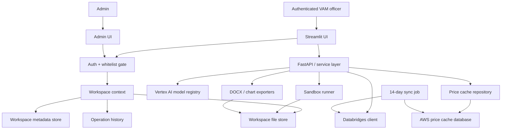

# Phase 2 Tech Stack

This document defines the technical architecture for Phase 2: authentication, isolated workspaces, flexible Vertex AI model selection, AWS-backed Databridges price caching, custom food baskets, the Climate Report Drafter, and the Databridges Data Explorer / Graph Composer.

## Design Principles

- Keep the existing Streamlit/FastAPI/LangGraph/Python stack unless a Phase 2 requirement forces a change.
- Add durable user/workspace infrastructure without breaking current alpha tools.
- Route all user-specific reads and writes through workspace-aware services.
- Route all LLM calls through a model resolver instead of direct singleton access.
- Make Databridges historical price reads cache-first.
- Treat LLM-generated code as untrusted and execute it outside the main app process.
- Keep cloud-provider details behind adapters where practical, but optimize the first implementation for the known deployment reality: Vertex AI for LLMs and an AWS database for cached Databridges data.

## What Carries Over From Phase 1 / Alpha

| Layer | Technology | Phase 2 stance |
|---|---|---|
| Frontend | Streamlit multipage app | Kept. Add auth gate, workspace settings, cache freshness UI, basket editor, and new tool pages. |
| Backend API | FastAPI + in-process Streamlit dispatcher | Kept. Add workspace-aware dependencies/middleware and new endpoints. |
| Orchestration | LangGraph | Kept for existing pipelines and new agentic tools where useful. |
| LLM integration | LangChain chat model interface | Kept, but instantiated through a registry/resolver. |
| LLM hosting | Vertex AI | Kept for Phase 2 model experimentation. |
| Data processing | pandas, numpy, openpyxl, chardet | Kept. |
| Visualisation | matplotlib, Base64/PNG rendering | Kept. Used by Price Bulletin and Data Explorer. |
| Report export | python-docx | Kept for generated DOCX reports. |
| Integrations | Databridges, Seerist, ReliefWeb, Trading Economics | Kept. Databridges price reads become cache-first. |
| Container | Docker / Python runtime | Kept. Add sandbox/container strategy for generated code. |
| Tests | pytest | Kept. Expand with auth, workspace, cache, basket, registry, and sandbox tests. |

## What Changes In Phase 2

| Area | Current state | Phase 2 target |
|---|---|---|
| Authentication | No app-wide user login gate | Required login plus admin-managed email whitelist. |
| User state | Mostly `st.session_state`, run-local artifacts | Durable workspace metadata, run history, generated files, and preferences. |
| LLM use | `app/shared/llm.py` singleton, env-selected model | Config-driven Vertex AI model registry and per-run resolver. |
| Price metadata | Country selection can call Databridges | Country metadata and price availability loaded from AWS cache. |
| Price rows | Databridges live calls for report windows | Cache-first reads with explicit manual delta refresh. |
| Food basket | Auto-selected commodities, unweighted sum | User-defined country basket with weighted calculation. |
| New tools | Existing validators/drafters only | Climate Report Drafter and Databridges Data Explorer / Graph Composer. |
| Code execution | No generated-code sandbox | Isolated sandbox runner for Data Explorer analysis/plots. |
| Auditability | Run metadata exists but not user/workspace complete | User, model, cache watermark, files, tool inputs, warnings, and outputs recorded per run. |

## Target Architecture



## Proposed Module Boundaries

The exact filenames can change during implementation, but Phase 2 should introduce these service boundaries:

```text
app/shared/auth.py                 # identity extraction, whitelist checks, auth-required helpers
app/shared/workspace.py            # WorkspaceContext, user/workspace lookup, path scoping
app/shared/storage.py              # generated file storage abstraction
app/shared/model_registry.py       # enabled Vertex AI model definitions and resolver
app/shared/llm.py                  # compatibility wrapper around model_registry
app/shared/audit.py                # run/event logging helpers
app/shared/databridges.py          # existing connector, extended only where needed

app/services/price_cache/          # AWS cache repository, sync logic, watermarks
app/services/food_basket/          # basket composition CRUD and weighted calculations
app/services/data_explorer/        # NL query planning, data execution, sandbox integration
app/services/climate_report/       # climate collectors, analysis, drafting, export

pages/Workspace_Settings.py        # model defaults, food basket settings, file/history views
pages/Admin.py                     # authorized email management
pages/Data_Explorer.py             # Databridges exploration chatbot
pages/Climate_Report_Drafter.py    # climate report tool
```

Existing files most likely affected:

- `app/shared/llm.py`
- `app/services/market_monitor/data_loader.py`
- `app/services/market_monitor/router.py`
- `app/services/market_monitor/graph.py`
- `pages/3_Price_Bulletin_Drafter.py`
- `app/streamlit_backend/dispatcher.py`
- `streamlit_app.py` / `Home.py`

## Authentication And Authorization

### Identity Provider

Phase 2 should support a pluggable identity-provider adapter, with one provider implemented first.

Likely first implementation options:

- Google Workspace OAuth, if the app remains aligned with the current GCP/Vertex development environment.
- Microsoft Entra ID, if WFP corporate identity is the deployment standard.
- AWS Cognito, if the first Phase 2 deployment is AWS-centered.

The identity provider is responsible for proving identity. The app authorization store is responsible for deciding whether the user can enter.

### Whitelist Authorization Store

Minimum schema:

```text
authorized_users
- email_normalized: string, primary key or unique index
- email_original: string
- role: enum("user", "admin", "developer", "evaluator")
- status: enum("active", "disabled")
- display_name_override: string nullable
- country_access: json/list nullable
- created_at: timestamp
- created_by: string
- updated_at: timestamp
- updated_by: string
- notes: string nullable
```

Required rules:

- Normalize emails by trimming whitespace and lowercasing.
- Deny access if the email is missing, unverified, not listed, or disabled.
- Fail closed if the authorization store cannot be reached.
- Never rely only on Streamlit UI hiding for authorization.
- All backend routes must receive or derive an authenticated workspace context.

### Session Handling

Streamlit session state can hold a short-lived session representation, but durable identity must come from the identity provider and authorization store.

Minimum session fields:

```text
auth.email
auth.email_normalized
auth.role
auth.user_id
auth.workspace_id
auth.display_name
auth.login_time
```

Do not store provider secrets or long-lived tokens in normal app logs.

## Workspace Storage

### Workspace Context

Every user-facing tool run receives a `WorkspaceContext`:

```python
class WorkspaceContext:
    user_id: str
    workspace_id: str
    email_normalized: str
    role: str
    display_name: str | None
    default_language: str | None
    default_model_key: str | None
    tool_model_defaults: dict[str, str]
```

### Workspace Metadata Store

Use the metadata store available in the deployment environment, but keep it behind a repository interface.

Candidate stores:

- Firestore for continuity with Phase 1 development.
- DynamoDB for AWS-centered deployment.
- RDS Postgres if the AWS price cache database is also used for workspace metadata.

Minimum logical collections/tables:

```text
users
- user_id
- email_normalized
- display_name
- role
- status
- created_at
- last_login_at
- default_language
- default_model_key
- tool_model_defaults_json

workspace_preferences
- workspace_id
- key
- value_json
- updated_at

operation_runs
- run_id
- workspace_id
- user_id
- tool_name
- status
- started_at
- completed_at
- input_json
- output_summary_json
- model_usage_json
- data_sources_json
- warnings_json
- error_message

generated_files
- file_id
- workspace_id
- run_id
- file_name
- mime_type
- storage_uri
- size_bytes
- created_at
- artifact_type
- metadata_json
```

### File Storage

Use object storage with a user/workspace namespace:

```text
s3://vam-unified-app-workspaces/{workspace_id}/uploads/{run_id}/...
s3://vam-unified-app-workspaces/{workspace_id}/generated/{run_id}/...
s3://vam-unified-app-workspaces/{workspace_id}/charts/{run_id}/...
```

If using GCS in development, keep the same logical layout:

```text
gs://vam-unified-app-workspaces/{workspace_id}/...
```

Use opaque `workspace_id` values, not raw emails, in storage paths. Store normalized email only in metadata.

## Vertex AI Model Registry

### Goals

- Remove hardcoded model use from tools.
- Allow model selection from enabled Vertex AI models.
- Support global defaults, workspace defaults, and per-tool defaults.
- Record model metadata on every LLM call.
- Make future model additions configuration changes, not code changes.

### Model Registry Configuration

Example config:

```yaml
default_model: gemini-2.5-pro
models:
  gemini-2.5-pro:
    provider: vertex_ai
    vertex_model_name: gemini-2.5-pro
    display_name: Gemini 2.5 Pro
    location: us-central1
    enabled: true
    capabilities: [chat, json, long_context]
    default_temperature: 0
    max_output_tokens: null
  gemini-2.5-flash:
    provider: vertex_ai
    vertex_model_name: gemini-2.5-flash
    display_name: Gemini 2.5 Flash
    location: us-central1
    enabled: true
    capabilities: [chat, json]
    default_temperature: 0
  future-model:
    provider: vertex_ai
    vertex_model_name: future-vertex-model-id
    display_name: Future Vertex AI model
    enabled: false
```

Model entries should be environment/config driven. Tool code must not hardcode the list of available models.

### Resolution Order

When a tool needs an LLM, resolve the model in this order:

1. Explicit run-level model override, if allowed.
2. User's saved per-tool model default.
3. User's saved workspace default model.
4. System default model.
5. Safe fallback model only if configured.

If the resolved model is disabled or unavailable, show an actionable error and log it.

### Suggested API

```python
class LLMRequestContext:
    workspace_id: str | None
    user_id: str | None
    tool_name: str
    requested_model_key: str | None = None
    temperature: float | None = None
    max_output_tokens: int | None = None

def resolve_model_config(ctx: LLMRequestContext) -> ModelConfig:
    ...

def get_chat_model(ctx: LLMRequestContext) -> BaseChatModel:
    ...
```

`app/shared/llm.py::get_model()` can remain temporarily as a compatibility wrapper, but it should delegate to the registry with a default context.

### LLM Audit Metadata

Every LLM call should record:

- `run_id`
- `workspace_id`
- `tool_name`
- `model_key`
- `vertex_model_name`
- `temperature`
- `max_output_tokens`
- request timestamp
- latency
- token usage if available
- error if failed

## AWS Databridges Price Cache

### Objective

The Price Bulletin tool must stop pulling large Databridges datasets during normal form interaction. The app reads historical Databridges price data from an AWS database synchronized every two weeks.

### Recommended Database

Prefer RDS Postgres or Aurora Postgres for the first implementation because the access patterns are relational and time-series-like:

- Filter by country, commodity, market, admin area, and date range.
- Join commodities, markets, and price rows.
- Compute latest cache watermark by country.
- Enforce uniqueness and upserts for monthly price records.

DynamoDB is possible but would require careful access-pattern design and duplicated indexes. If the provided AWS database is not Postgres, implement the repository interface against the provided engine.

### Repository Interface

```python
class PriceDataRepository:
    def list_countries(self) -> list[CountryRecord]: ...
    def get_country_metadata(self, country_iso3: str) -> CountryMetadata: ...
    def get_price_rows(
        self,
        country_iso3: str,
        start_date: date,
        end_date: date,
        commodity_ids: list[int] | None = None,
        market_ids: list[int] | None = None,
        admin1_names: list[str] | None = None,
    ) -> pd.DataFrame: ...
    def get_watermark(self, country_iso3: str) -> date | None: ...
```

### Logical Schema

```text
databridges_countries
- country_iso3: varchar primary key
- country_name: varchar
- currency_code: varchar nullable
- has_price_data: boolean
- last_synced_at: timestamp nullable

databridges_commodities
- commodity_id: integer
- country_iso3: varchar
- commodity_name: varchar
- category: varchar nullable
- active: boolean
- last_seen_at: timestamp
- unique(country_iso3, commodity_id)

databridges_markets
- market_id: integer
- country_iso3: varchar
- market_name: varchar
- admin1_name: varchar nullable
- admin2_name: varchar nullable
- latitude: decimal nullable
- longitude: decimal nullable
- active: boolean
- last_seen_at: timestamp
- unique(country_iso3, market_id)

databridges_price_monthly
- country_iso3: varchar
- commodity_id: integer
- market_id: integer nullable
- price_date: date
- price: numeric
- currency: varchar nullable
- unit: varchar nullable
- price_flag: varchar nullable
- price_type_name: varchar nullable
- source_payload_hash: varchar nullable
- last_synced_at: timestamp
- primary key(country_iso3, commodity_id, market_id, price_date, price_type_name)

databridges_sync_runs
- sync_run_id: uuid
- sync_type: enum("scheduled_full", "scheduled_incremental", "manual_delta")
- country_iso3: varchar nullable
- requested_start_date: date nullable
- requested_end_date: date nullable
- status: enum("running", "completed", "failed")
- rows_inserted: integer
- rows_updated: integer
- started_at: timestamp
- completed_at: timestamp nullable
- error_message: text nullable
- triggered_by_user_id: varchar nullable

databridges_country_watermarks
- country_iso3: varchar primary key
- max_price_date: date nullable
- last_successful_sync_at: timestamp nullable
- last_sync_run_id: uuid nullable
```

Recommended indexes:

```text
idx_price_country_date on databridges_price_monthly(country_iso3, price_date)
idx_price_country_commodity_date on databridges_price_monthly(country_iso3, commodity_id, price_date)
idx_price_country_market_date on databridges_price_monthly(country_iso3, market_id, price_date)
idx_markets_country_admin1 on databridges_markets(country_iso3, admin1_name)
idx_commodities_country_name on databridges_commodities(country_iso3, commodity_name)
```

### Scheduled Sync

Requirement:

- All Databridges data needed by Price Bulletin is downloaded automatically every two weeks.

Implementation guidance:

- Initial backfill loads all supported historical price rows.
- Scheduled runs reconcile all supported countries every 14 days.
- Upserts must be idempotent.
- Sync logs must record rows inserted/updated and failures.
- Failures should not delete existing cached data.
- Admins should be able to see latest sync status.

### Manual Latest Sync

Manual sync is a user action from the Price Bulletin form.

Flow:

1. Determine selected country.
2. Read cache watermark for that country.
3. If no watermark exists, do not silently run a full historical sync from the user UI. Show an admin/cache missing message.
4. Set `start_date` to the watermark date or the following day/month depending on Databridges inclusivity.
5. Set `end_date` to the current date.
6. Apply selected commodity IDs and/or market/admin filters if available.
7. Call Databridges for only the delta.
8. Normalize rows.
9. Merge with the active run dataset.
10. Persist or not according to the chosen policy.
11. Record a `manual_delta` sync event.

Important:

- Use upsert logic if manual deltas write to the shared cache.
- Avoid duplicate rows when Databridges start dates are inclusive.
- Surface partial failures to the user.

## Price Bulletin Integration

### Current Behavior To Replace

The current flow loads country metadata in `pages/3_Price_Bulletin_Drafter.py` after country selection. The backend metadata function in `app/services/market_monitor/data_loader.py` calls Databridges for commodities, markets, regions, and price rows.

Phase 2 replacement:

- `/market-monitor/countries` reads from `PriceDataRepository`.
- `/market-monitor/countries/{country}/metadata` reads from cache tables.
- Country selection does not call `get_databridges_client().list_monthly_prices`.
- Report generation reads selected date windows from cache unless manual delta rows are part of the active run.

### Cache Freshness UI

Price Bulletin page should show:

- Latest cached price date for selected country.
- Last successful sync timestamp.
- Whether selected reporting period is fully covered by cached data.
- Button: "Sync Latest Data" when cache may be behind.
- Warning if cache is stale or missing.

## Custom Food Basket Engine

### Current Behavior

Current `FoodBasket` calculation is an unweighted sum of selected commodity price columns after monthly aggregation. Regional basket values are also summed after grouping by month, admin region, and commodity.

### Target Behavior

The food basket is calculated from a saved composition:

```text
Basket_t = sum(P_i,t * W_i)
```

Where:

- `P_i,t` is the monthly average price for commodity `i` at time `t`.
- `W_i` is the user-defined weight for commodity `i`.

Default Phase 2 interpretation:

- Weights are normalized shares.
- Valid saved basket weights should sum to 1.0 within tolerance, for example `0.999 <= sum(weights) <= 1.001`.

If WFP requires physical quantities, add:

```text
calculation_mode: "normalized_weight" | "quantity_cost"
quantity_unit: nullable string
```

### Basket Schema

```text
food_basket_compositions
- basket_id: uuid
- workspace_id: string
- country_iso3: varchar
- name: varchar
- status: enum("active", "archived")
- calculation_mode: enum("normalized_weight", "quantity_cost")
- is_default_for_country: boolean
- created_at: timestamp
- updated_at: timestamp

food_basket_items
- basket_item_id: uuid
- basket_id: uuid
- commodity_id: integer
- commodity_name_snapshot: varchar
- weight: numeric
- sort_order: integer
```

Rules:

- A workspace can have multiple named basket compositions per country.
- One basket can be marked default per workspace/country.
- Basket items should reference commodity IDs, not only names.
- Store commodity name snapshots for readability and historical reproducibility.
- Prevent duplicate commodity IDs in one basket.
- Warn if a saved commodity is no longer present in cache metadata.

### Missing Data Handling

If one or more basket commodities are missing for a month:

- Do not silently treat missing prices as zero.
- Compute basket only from available components if policy allows, and record coverage.
- Surface `selected_component_count`, `available_component_count`, and `missing_component_names`.
- Include coverage warnings in charts and reports.

Recommended policy:

- If no basket items are available for a month, basket value is null.
- If partial coverage exists, compute the weighted basket on available components only if weights can be renormalized and label it as partial coverage.
- Otherwise require all components and mark missing periods null.

This policy should be finalized with VAM methodology owners.

## Databridges Data Explorer / Graph Composer

### Components

```text
Natural language request
  -> Query planner
  -> Structured Databridges query spec
  -> Data executor
  -> Analysis planner
  -> Sandbox code runner
  -> Chart/data artifact renderer
  -> Workspace file saver
```

### Structured Query Spec

The LLM should produce a validated query object, not raw URLs:

```json
{
  "country_iso3": "SOM",
  "dataset": "monthly_prices",
  "commodities": [{"commodity_name": "Maize (local)"}],
  "markets": [{"market_name": "Mogadishu"}],
  "admin1": [],
  "start_date": "2025-01-01",
  "end_date": "2025-12-31",
  "aggregation": "monthly_mean"
}
```

The app validates the query spec before execution.

### Data Execution

The executor may fulfill requests from:

- AWS cache, for historical monthly price data already synchronized.
- Databridges live API, for uncached or latest data if allowed.

The user-facing concept remains Databridges exploration. Internally, using the cache where possible is acceptable if the result metadata makes the source clear.

### Sandbox Requirements

Do not run LLM-generated Python in the main app process.

Minimum sandbox properties:

- Separate process or container.
- No network access.
- No shell/subprocess execution.
- No access to app environment variables/secrets.
- Read-only mounted input data.
- Write access only to a temporary output directory for charts/data.
- CPU and memory limits.
- Wall-clock timeout.
- Restricted package allowlist, initially `pandas`, `numpy`, `matplotlib`, and standard safe utilities.
- Output file type allowlist: PNG, CSV, JSON, TXT.
- Full stdout/stderr capture.
- Cleanup after execution.

Recommended production approach:

- Docker or another container isolation mechanism with no network and resource limits.

Prototype-only fallback:

- Separate Python process with import restrictions and temporary directory constraints. This is not sufficient as a final security boundary.

## Climate Report Drafter

### Component Boundaries

```text
climate_report/
- collectors.py       # source-specific fetchers
- indicators.py       # anomaly calculations and thresholds
- prompts.py          # drafting prompts
- graph.py            # LangGraph or pipeline orchestration
- schemas.py          # input/output contracts
- router.py           # API endpoints
- export.py           # DOCX/report integration
```

### Minimum Input Schema

```text
country
admin_area optional
reporting_period_start
reporting_period_end
language optional
selected_indicators optional
model_key optional
```

### Output Requirements

- Structured draft sections.
- Source metadata.
- Indicator summary table.
- Warnings for missing data.
- Generated DOCX file.
- Operation history record.

### Data Source Abstraction

Climate sources are not finalized. Implement collectors behind interfaces:

```python
class ClimateDataSource:
    name: str
    def fetch(self, query: ClimateQuery) -> ClimateDataset: ...
```

Candidate sources to confirm:

- CHIRPS precipitation.
- NDVI or vegetation anomaly datasets.
- Temperature anomaly datasets.
- FEWS NET or other food security climate products.
- Internal WFP climate data if available.

## Operation History And Audit Events

Every tool run should write:

- Authenticated user/workspace.
- Tool name.
- Input parameters.
- Model selected.
- Data source(s).
- Cache watermark(s).
- Manual sync details if any.
- Generated artifacts.
- Warnings.
- Error details.
- Timestamps and duration.

Event categories:

```text
auth.login_success
auth.login_denied
admin.authorized_user_created
workspace.preference_updated
llm.call_started
llm.call_completed
price_cache.query
price_cache.manual_delta_sync
tool.run_started
tool.run_completed
tool.run_failed
sandbox.execution_started
sandbox.execution_completed
sandbox.execution_blocked
file.generated
file.downloaded
```

## Evals And Tests

### Unit Tests

- Email normalization and whitelist behavior.
- Workspace path scoping.
- Model resolver fallback order.
- Price cache repository queries.
- Manual delta date logic.
- Food basket validation and weighted calculation.
- Sandbox disallowed imports/actions.

### Integration Tests

- Unauthorized user cannot access app routes.
- User A cannot read User B files/preferences/runs.
- Country metadata endpoint reads cache, not Databridges.
- Price Bulletin generation uses saved basket composition.
- Manual latest sync calls Databridges with bounded date range.
- LLM tools record selected model.
- Data Explorer can generate a chart from a safe query.

### Evals

- Model comparison for each LLM-using tool.
- Grounding checks for generated report text.
- Price Bulletin numeric consistency checks.
- Climate report source-grounding checks once methodology is finalized.
- Data Explorer NL-to-query correctness.

## Configuration And Secrets

New configuration categories:

```text
AUTH_PROVIDER
OAUTH_CLIENT_ID
OAUTH_CLIENT_SECRET
AUTH_ALLOWED_DOMAINS optional

WORKSPACE_STORAGE_BACKEND
WORKSPACE_BUCKET
WORKSPACE_METADATA_BACKEND

VERTEX_PROJECT_ID
VERTEX_LOCATION
LLM_MODEL_REGISTRY_PATH
DEFAULT_LLM_MODEL

PRICE_CACHE_BACKEND
PRICE_CACHE_DATABASE_URL or AWS-specific secret reference
PRICE_CACHE_SYNC_ENABLED
PRICE_CACHE_SYNC_INTERVAL_DAYS=14

SANDBOX_BACKEND
SANDBOX_TIMEOUT_SECONDS
SANDBOX_MEMORY_MB
SANDBOX_OUTPUT_MAX_MB
```

Do not expose secrets to sandboxed code.

## Migration Strategy

1. Add auth/workspace services with a development bypass only for local testing.
2. Add model registry while keeping `get_model()` compatibility.
3. Add price cache repository interface and a local/test implementation.
4. Replace Price Bulletin metadata calls with repository calls.
5. Add AWS repository implementation when database details are available.
6. Add basket composition storage and calculation.
7. Migrate generated outputs to workspace file storage.
8. Add Data Explorer sandbox behind a feature flag.
9. Add Climate Report Drafter behind a feature flag.
10. Remove temporary bypasses before pilot.

## Known Open Technical Decisions

- Final identity provider.
- Final AWS database engine and credentials pattern.
- Whether workspace metadata lives in AWS, GCP, or the same price cache database.
- Whether manual delta sync writes to the shared cache.
- Whether food basket weights are normalized shares, quantities, or both.
- Final sandbox backend for pilot.
- Climate data sources and thresholds.
- Whether Phase 1 credit ledger remains in Phase 2 scope.
